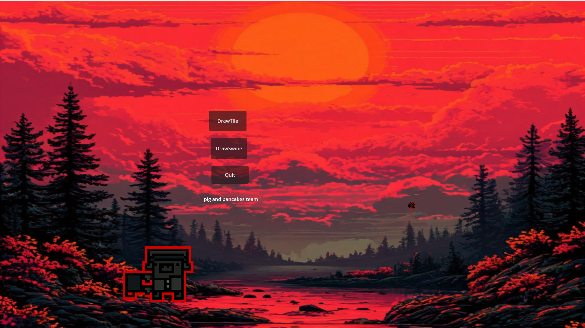

# RandomSwineDraw     
A program capable of procedurally generating AnimationSprite2D and TileMap

This is a small tool for Godot developers. It was created using version 4.1.1. I created my own node in Godot—it's responsible for the location and node the program will generate. I created an .exe file with a menu and two modes: TileMap and AnimationSprite2D. If you ever need to test it, check it out.

Warnings: It's best NOT to run the generation process within the engine. DO NOT set a high total steps value, otherwise the game may freeze or crash under heavy load. I have 500 total steps in my project; if you're worried that's too much, it's best to reduce the value. If you experience a crash, don't worry. I've experienced this myself. 1) Close the game, for example, through the task manager. 2) Go to the project folder and clear the code (if you don't understand what to clear, save the code somewhere else). Then, go into the project using godot and paste the copied code (I have two separate scripts for each mode). Then set the total steps to a lower value, for example, 100.
And.. I don't know how this work in new version Godot

If you want to DOWNLOAD my project: I left a release that contains a zip folder of my project along with an executable file and other things.

Anyway, thanks for reading. This project is unlikely to be updated, unlike pig and pancakes, but if you encounter any problems, don't hesitate to post in the discussions.
And more screens:

                                                         pig and pancakes team
